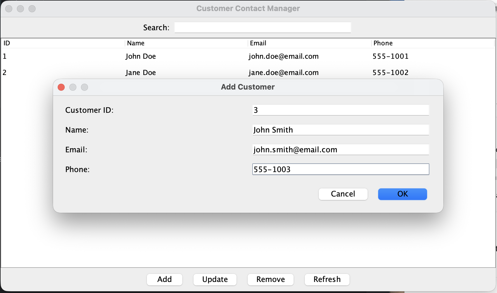

# Customer Contact Manager

This is a Java application I built to practice managing customer contact information.

The project includes a console version and a Swing graphical interface.

## Features

- List all customers
- Find a customer by ID
- Add a new customer
- Update customer information
- Remove a customer
- Prevent duplicate customer IDs
- Validate menu, email, phone, and numeric ID input
- Search customers in the GUI
- Use structured Add and Update forms
- Save customer data between program runs
- Automated tests for customer management and file storage

## Technologies

- Java
- Swing
- Maven
- JUnit 5
- IntelliJ IDEA
- Git and GitHub
- CSV file storage

## Project Files

- `Main.java` handles the console menu and user input.
- `SwingMain.java` provides the graphical interface.
- `Customer.java` represents a customer.
- `CustomerManager.java` manages customer records.
- `CustomerFileStorage.java` loads and saves customer data.
- `CustomerManagerTest.java` tests customer management operations.
- `CustomerFileStorageTest.java` tests CSV storage.

## Running the Console Version

Open the project in a Java-compatible IDE and run:

```text
src/com/customercontactmanager/Main.java
```

The program displays a menu in the console.

## Running the Graphical Version

Open and run:

```text
src/com/customercontactmanager/SwingMain.java
```

The graphical interface provides a customer table, search field, and buttons for adding, updating, removing, and refreshing records.

## Testing the Program

Try each menu option or GUI button:

1. List or view the existing customers.
2. Find a customer using an existing ID.
3. Add a customer with a unique ID.
4. Try adding a duplicate ID.
5. Update an existing customer.
6. Remove a customer.
7. Close and reopen the program to confirm saved data remains.

Also test invalid input:

- Letters when a numeric ID is requested
- An invalid email such as `hello`
- A short phone number such as `123`
- A blank name, email, or phone number
- Updating or removing without selecting a GUI row

## Automated Tests

The project uses JUnit 5 tests for customer management and CSV storage.

To run the tests with Maven:

```text
mvn test
```

The tests verify adding, finding, updating, removing, duplicate-ID protection, and saving/loading customer records.

## Data Storage

Customer records are saved locally in `customers.csv`. This file is ignored by Git because it may contain personal information.

## Application Preview


## Developer

Joshua Allgood